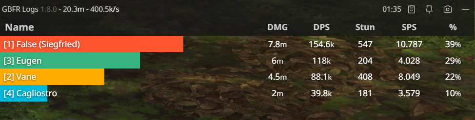
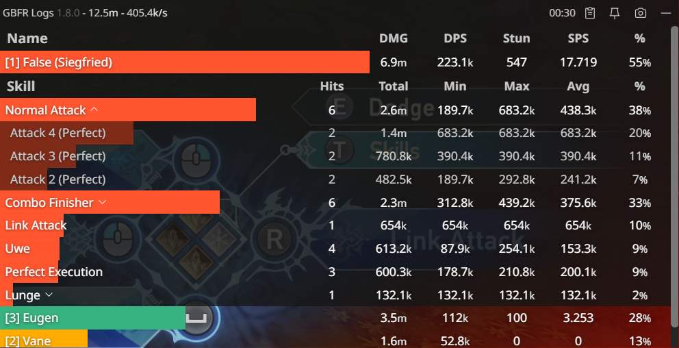
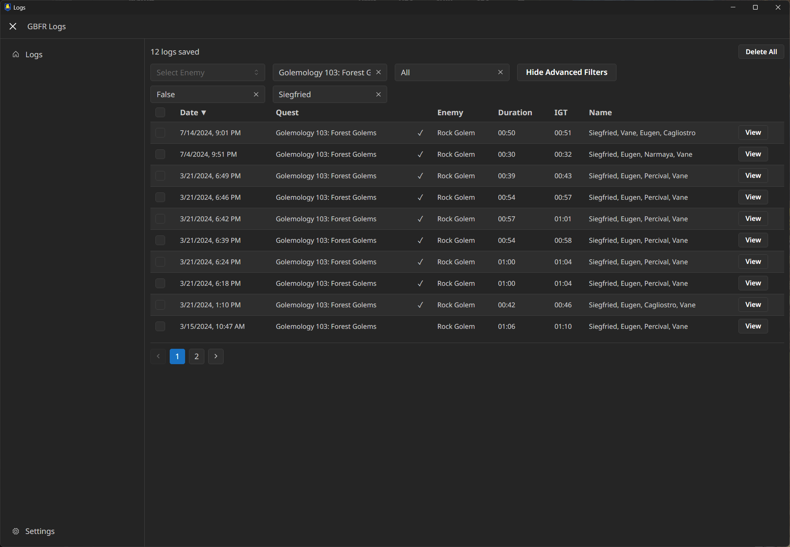
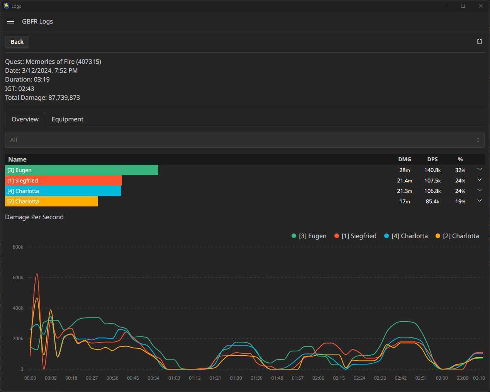
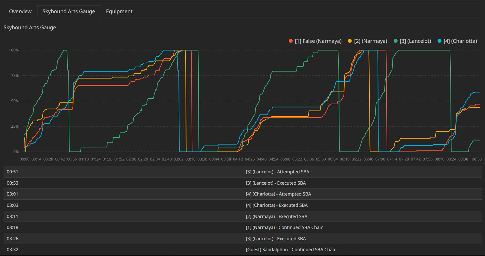
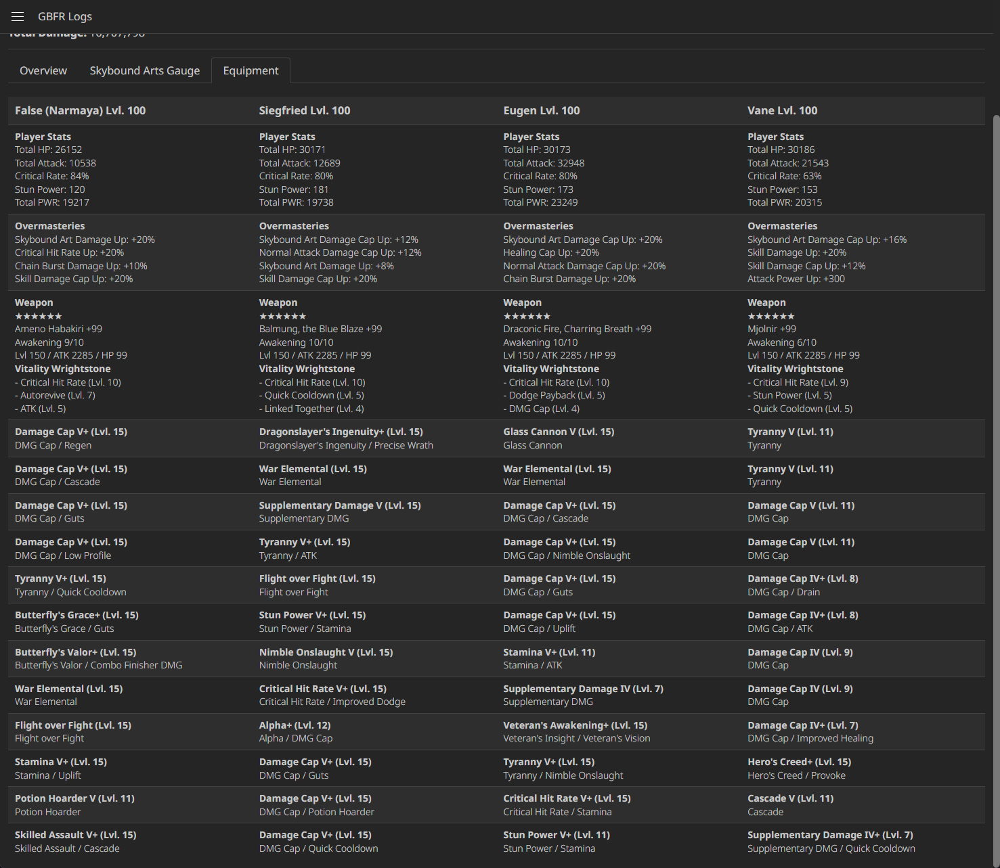
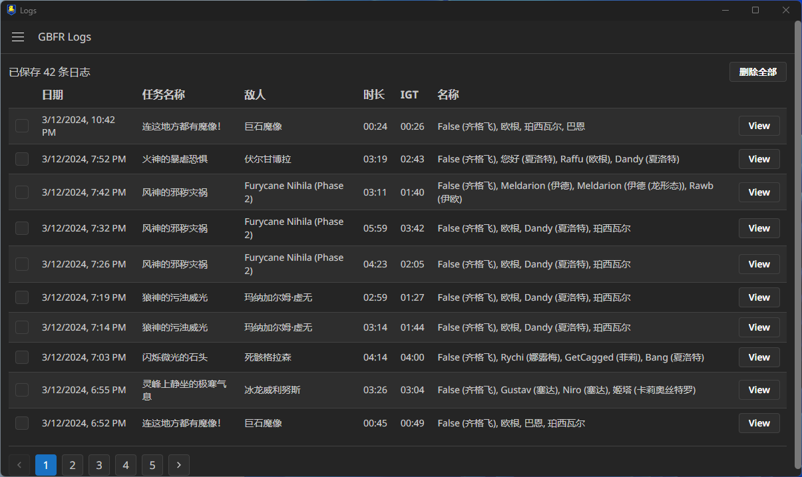
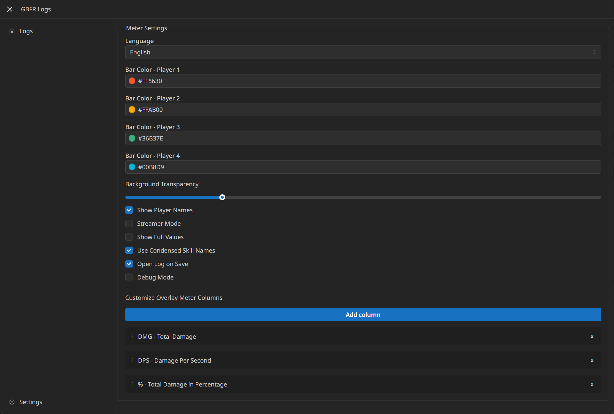

# GBFR Logs Awa Edition

Community-maintained fork by [onelittlechildawa](https://github.com/onelittlechildawa) for Granblue Fantasy: Relink 2.0.2.

This edition is based on [false-spring/gbfr-logs](https://github.com/false-spring/gbfr-logs) and retains its MIT license and upstream credits. The Awa Edition adds game 2.0.2 compatibility, the six new playable characters, separate same-character multiplayer tracking, automatic battle-log saving, a repaired battle-end hook, and updated skill-name tracking.

## How to install

- Go to [Releases](https://github.com/onelittlechildawa/gbfr-logs/releases/)
- Download the latest .msi installer and run it.
- Open GBFR Logs Awa Edition after the game is already running.

## Screenshots

### DPS Overlay

### Skill Tracking (with skill grouping)

### Historical Logs (with filtering)

### DPS Charts

### SBA Tracking

### Equipment Tracking

### Multi-language Support

## Settings / Customization

## Frequently Asked Questions

> Q: I closed the meter, but it's still running?

When you close the windows, GBFR Logs Awa Edition continues to run in your task tray in the bottom right of your desktop.

This task tray functionality is meant to give you more options for customizing:

- This lets you close the logs window, but be able to reopen it again later.
- You can toggle clickthrough of the overlay as well.

> Q: The meter isn't updating or displaying anything.

Try running the program after the game has been launched. Be sure to run the program as admin.

> Q: The application is not working / launching.

GBFR Logs Awa Edition uses your built-in Microsoft Edge Webview2 Runtime to run the application. This keeps the app relatively small as we don't have to package in a browser.

However, you may have an out-of-date or missing "Webview2 Runtime":

- Install the latest one from Microsoft: https://developer.microsoft.com/en-us/microsoft-edge/webview2/?form=MA13LH#download (Evergreen Bootstrapper should work here)

> Q: Is this safe? My antivirus is marking the installation as a virus / malware.

As always, this is up to you to trust GBFR Logs Awa Edition. The program can trigger false positive flags. There are reasons why it can give such alerts:

- GBFR Logs Awa Edition does code DLL injection into the running game process which can look like a virus-like program.
- GBFR Logs Awa Edition reads game memory and modifies game code at runtime in order to receive parser data.
- I recommend adding an exception / whitelisting for the installation folder so that your anti-virus does not delete it while your game is running, but you may not need to do so if you haven't ran into this issue.

See [how to add an exclusion to Windows Defender](https://support.microsoft.com/en-us/windows/add-an-exclusion-to-windows-security-811816c0-4dfd-af4a-47e4-c301afe13b26).

> Q: How do I update?

Automatic updates are disabled in the Awa Edition so an upstream release cannot overwrite this fork. Download new installers manually from this fork's [Releases](https://github.com/onelittlechildawa/gbfr-logs/releases) page.

> Q: How do I uninstall?

You can uninstall GBFR Logs Awa Edition the normal way through the Control Panel or by running the uninstall script in the folder where you installed it to. You may also want to remove these folders.

- `%AppData%\gbfr-logs-awa`

> Q: How do I add/edit my language?

Read [src-tauri/lang/README.md](./src-tauri/lang/README.md) for more information on how to add/edit language support!

> Q: My issue isn't listed here, or I have a suggestion.

Create a [new GitHub issue](https://github.com/onelittlechildawa/gbfr-logs/issues) in this fork.

## For Developers

- Install nightly Rust ([rustup.rs](https://rustup.rs/)) + [Node.js](https://nodejs.org/en/download).
- Install NPM dependencies with `npm install`
- `npm run tauri dev`

## Under the hood

This project is split up into a few subprojects:

- `src-hook/` - Library that is injected into the game that broadcasts essential damage events.
- `src-tauri/` - The Tauri Rust backend that communicates with the hooked process and does parsing.
- `protocol/` - Defines the message protocol used by hook + back-end.
- `src/` - The JS front-end used by the Tauri web app

## Credits

Maintained as the Awa Edition by [onelittlechildawa](https://github.com/onelittlechildawa).

This project would not have been possible without the following folks:

- [nyaoouo/GBFR-ACT](https://github.com/nyaoouo/GBFR-ACT) for the original reverse engineering work.
- [Harkain](https://github.com/Harkains) for their work on formatting and translating skills to friendly English names.
- [false-spring/gbfr-logs](https://github.com/false-spring/gbfr-logs), the upstream project this edition is based on.
## Disclaimer

Please keep in mind that this tool is meant to improve the experience that Cygames has provided us and is not meant to cause them or other players damage. GBFR Logs Awa Edition modifies your running game client and is not guaranteed to work after game patches, in which case you may experience instability or crashes.
